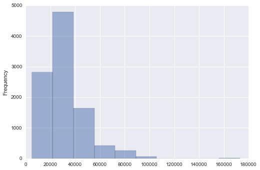
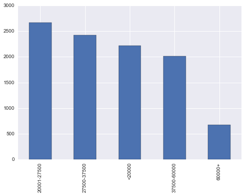
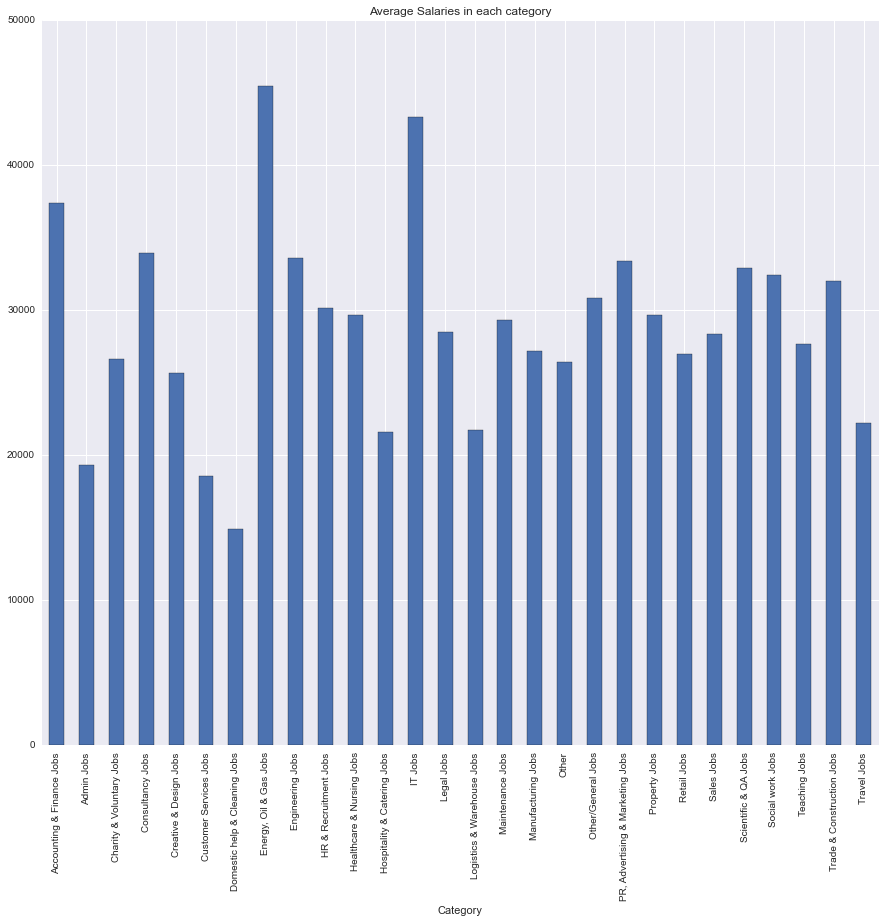
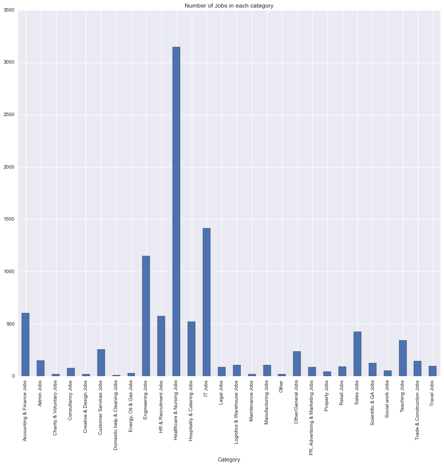
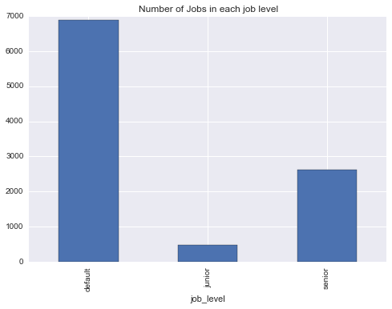
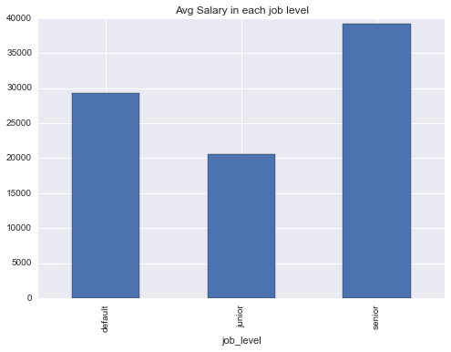
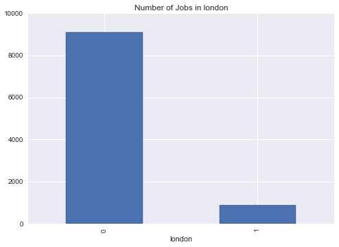
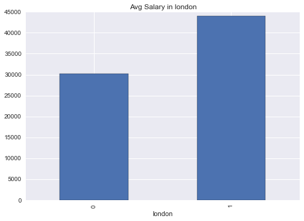

# Digging Into Data - Predict_Salary


```python
%matplotlib inline

import data_io
import matplotlib.pyplot as plt
import numpy as np
import pickle
import pandas as pd
from sklearn.ensemble import RandomForestRegressor,RandomForestClassifier
from sklearn.tree import ExtraTreeRegressor
from sklearn.feature_extraction.text import CountVectorizer
from sklearn.feature_extraction import DictVectorizer
from sklearn.pipeline import Pipeline
```

#### The below code is adding salary bins to the train data set.


```python
jobs_df = pd.read_csv('train-cedited.csv')
#jobs_df.head()
```


```python
jobs_df['Salary_Range'] = "NA"
def func(row):
    if row['SalaryNormalized'] > 0 and row['SalaryNormalized'] < 20000:
        return '<20000'
    elif row['SalaryNormalized'] >= 20000  and row['SalaryNormalized'] < 27500:
        return '20001-27500'
    elif row['SalaryNormalized'] >= 27500  and row['SalaryNormalized'] < 37500:
        return '27500-37500'
    elif row['SalaryNormalized'] >= 37500  and row['SalaryNormalized'] < 60000:
        return '37500-60000'
    elif row['SalaryNormalized'] >= 60000:
        return '60000+'
    elif row['SalaryNormalized'] <= 0:
        return 'NA'
    else:
        return 'other'
jobs_df['Salary_Range'] = jobs_df.apply(func, axis=1)
# subsetting the data frame by removing the cases for age < 0
#print len(jobs_df)
jobs_df = jobs_df[jobs_df.Salary_Range != 'NA']
#print len(jobs_df)
#jobs_df.head()
```

#### Created Histogram for SalaryNormalized


```python
from seaborn import *
jobs_df['SalaryNormalized'].plot(kind='hist', alpha=0.5)
```


    <matplotlib.axes._subplots.AxesSubplot at 0x2083d908>





```python
jobs_df.describe()
```


<div>
<table border="1" class="dataframe">
  <thead>
    <tr style="text-align: right;">
      <th></th>
      <th>Id</th>
      <th>SalaryNormalized</th>
    </tr>
  </thead>
  <tbody>
    <tr>
      <th>count</th>
      <td>10000.000000</td>
      <td>10000.000000</td>
    </tr>
    <tr>
      <th>mean</th>
      <td>58883558.683700</td>
      <td>31522.615600</td>
    </tr>
    <tr>
      <th>std</th>
      <td>7383340.440499</td>
      <td>16153.358741</td>
    </tr>
    <tr>
      <th>min</th>
      <td>12612628.000000</td>
      <td>5184.000000</td>
    </tr>
    <tr>
      <th>25%</th>
      <td>55408410.500000</td>
      <td>20648.500000</td>
    </tr>
    <tr>
      <th>50%</th>
      <td>62005797.500000</td>
      <td>27500.000000</td>
    </tr>
    <tr>
      <th>75%</th>
      <td>64796514.250000</td>
      <td>37500.000000</td>
    </tr>
    <tr>
      <th>max</th>
      <td>66190737.000000</td>
      <td>172800.000000</td>
    </tr>
  </tbody>
</table>
</div>


#### Create bar chart for salary range vs number of job ads


```python
counts = jobs_df['Salary_Range'].value_counts()
counts.plot(kind='bar')
```


    <matplotlib.axes._subplots.AxesSubplot at 0x20d2bba8>





#### Created a bar chart for average salaries for each category


```python
grp1 = jobs_df.groupby('Category')['SalaryNormalized'].mean()
my_plot1 = grp1.plot(kind='bar',title="Average Salaries in each category",figsize=(15, 13))
```





#### Created a bar chart for number of jobs in each category


```python
grp2 = jobs_df.groupby('Category')['Id'].count()
my_plot2 = grp2.plot(kind='bar',title="Number of Jobs in each category",figsize=(15, 13))
```





#### The below code parses through the job titles and  creates a new feature on the base of Seniority 


```python
def estimate_seniority(job_title):
    # Estimates the seniority of a job
    # based on key words in the job title text

    # Input
    # job_title: input text

    # Output
    # seniority: 'junior', 'default', or 'senior'

    seniority = 'default'
    jobtitlewords = str(job_title).lower().split()

    # ignore internships
    if (('intern' in jobtitlewords)
        or ('internship' in jobtitlewords)):
        return 'INTERN'

    senior_words = ['sr',
                    'senior',
                    'lead',
                    'principal',
                    'director',
                    'manager',
                    'cto',
                    'chief',
                    'vp',
                    'head'
                    ]

    junior_words = ['jr',
                    'junior',
                    'associate',
                    'assistant'
                    ]

    for titleword in jobtitlewords:
        titleword = titleword.replace(',', '')
        titleword = titleword.replace('.', '')

        if titleword in senior_words:
            seniority = 'senior'
            break
        elif titleword in junior_words:
            seniority = 'junior'
            break

    return seniority
    
```


```python
jobs_df['job_level'] = jobs_df['Title'].apply(lambda x: estimate_seniority(x))
#jobs_df.head()
```

#### Created a barchart for number of jobs vs job levels as per above function


```python
grp3 = jobs_df.groupby('job_level')['Id'].count()
my_plot3 = grp3.plot(kind='bar',title="Number of Jobs in each job level")
```





#### Created a barchart for average salary for different job levels


```python
grp4 = jobs_df.groupby('job_level')['SalaryNormalized'].mean()
my_plot4 = grp4.plot(kind='bar',title="Avg Salary in each job level")
```





#### Created a feature based on whether location is London or not


```python
jobs_df['london'] = 0
def london(row):
    location = row['LocationNormalized']
    if location.lower() == 'london':
        return 1
    else:
        return 0
jobs_df['london'] = jobs_df.apply(london, axis=1)
```


```python
grp5 = jobs_df.groupby('london')['Id'].count()
my_plot5 = grp5.plot(kind='bar',title="Number of Jobs in london")
```





```python
grp6 = jobs_df.groupby('london')['SalaryNormalized'].mean()
my_plot6 = grp6.plot(kind='bar',title="Avg Salary in london")
```





### Natural Language Processing
#### Calculated term frequencies in job description and calculated tf-idf for job titles
#### Stemming, Remove Stop Words, Tokenize
#### Identified top words based on salary distribution


```python
from nltk.tokenize import WhitespaceTokenizer
from CleanTokenize import CleanAndTokenize
from nltk.corpus import stopwords
import nltk.tag, nltk.util, nltk.stem
from textblob import TextBlob as tb
import math
from collections import Counter

stopword_list = stopwords.words('english')
porter = nltk.PorterStemmer()
```


```python
def cleanText(comment_text):
    comment_stemmed_tokens = []
    comment_features = {}
    try:
        token_list = CleanAndTokenize(comment_text)
    except:
        if isinstance(comment_text,basestring):
            token_list = comment_text.split()
        else:
            token_list = []
    token_list = [word for word in token_list if word not in stopword_list]
    comment_stemmed_tokens.extend([porter.stem(token) for token in token_list])
    cleaned_Text = ' '.join(comment_stemmed_tokens)
    return cleaned_Text
```


```python
jobs_df['textTokens'] = jobs_df['FullDescription'].apply(lambda x: cleanText(x))
jobs_df['titleTokens'] = jobs_df['Title'].apply(lambda x: cleanText(x))
#jobs_df.head()
```


```python
JobTitle = jobs_df.groupby('Salary_Range').agg({'titleTokens': 'sum'}).reset_index()
JobDesc = jobs_df.groupby('Salary_Range').agg({'textTokens': 'sum'}).reset_index()
JobTitle.head(n=3)
```


<div>
<table border="1" class="dataframe">
  <thead>
    <tr style="text-align: right;">
      <th></th>
      <th>Salary_Range</th>
      <th>titleTokens</th>
    </tr>
  </thead>
  <tbody>
    <tr>
      <th>0</th>
      <td>20001-27500</td>
      <td>engin system analystpioneer miser engin system...</td>
    </tr>
    <tr>
      <th>1</th>
      <td>27500-37500</td>
      <td>stress engin glasgowmodel simul analystengin s...</td>
    </tr>
    <tr>
      <th>2</th>
      <td>37500-60000</td>
      <td>project engin pharmaceutprincip composit stres...</td>
    </tr>
  </tbody>
</table>
</div>


```python
title_dict = dict()
for index, row in JobTitle.iterrows():
    Salary_Range = row['Salary_Range']  
    title_dict[Salary_Range] = tb(row['titleTokens'])
    
text_dict = dict()
for index, row in JobDesc.iterrows():
    Salary_Range = row['Salary_Range']  
    text_dict[Salary_Range] = tb(row['textTokens'])
```


```python
bloblist = title_dict.values()
Job_Freq2 = []
for sal_range, blob in title_dict.items():
    print("Top words in salary range {}".format(sal_range))
    scores = {word: tfidf(word, blob, bloblist) for word in blob.words}
    sorted_words = sorted(scores.items(), key=lambda x: x[1], reverse=True)
    temp_list = []
    for word, score in sorted_words[:5]:
        print("\tWord: {}, TF-IDF: {}".format(word.encode('utf-8'), round(score, 5)))
        temp_list.append(word)
        row = [word,score,sal_range]
        Job_Freq2.append(row)

Job_Freq2_df = pd.DataFrame(Job_Freq2)
Job_Freq2_df.columns = ['word','tf-idf score','Salary_Range']
Job_Freq2_df.to_csv('Job_Freq2.csv')
```


```python
Text_freq = dict()
Job_Freq = []
for index, row in JobDesc.iterrows():
    
    Salary_Range = row['Salary_Range']
    final_text = row['textTokens']
    frequent_words = Counter(final_text.split()).most_common()[:30]
    temp_list = []
    
    for word,count in frequent_words:
        temp_list.append(word)
        row = [word,count,Salary_Range]
        Job_Freq.append(row)
    Text_freq[Salary_Range] = temp_list
    


Job_Freq_df = pd.DataFrame(Job_Freq)
Job_Freq_df.columns = ['word','count','Salary_Range']
Job_Freq_df.to_csv('Job_Freq.csv')
```

#### Dividing the training data set into 2 one for training and another  for validation 


```python
msk = np.random.rand(len(jobs_df)) < 0.799

train = jobs_df[msk]
test = jobs_df[~msk]
print len(train)
print len(test)
```

    8074
    1926
    


```python
train = train.drop('titleTokens', 1)
train = train.drop('textTokens', 1)
#train.head(n=3)
```


```python
test = test.drop('titleTokens', 1)
test = test.drop('textTokens', 1)
#test.head(n=3)
```


```python
train.to_csv('train-cedited.csv')
test.to_csv('test-cedited.csv')
```

### Creating/loading mapper and transform functions
#### Feature Set: Bag of Words (job title, description, location normalized, location raw) + Category


```python
import sklearn
from sklearn.base import BaseEstimator
from HTMLParser import HTMLParser

class FeatureMapper:
    def __init__(self, features):
        self.features = features

    def fit(self, X, y=None):
        print "fit"
        for feature_name, column_name, extractor in self.features:
            print "fit"
            extractor.fit(X[column_name], y)


    def transform(self, X):
        extracted = []
        for feature_name, column_name, extractor in self.features:
            fea = extractor.transform(X[column_name])
            if hasattr(fea, "toarray"):
                extracted.append(fea.toarray())
            else:
                extracted.append(fea)
        print "transform"
        if len(extracted) > 1:
            array_final_test = np.concatenate(extracted, axis=1)
        else:
            array_final_test = extracted[0]

        test_df = pd.read_csv('test-cedited.csv')
        dummy_cat_test = pd.get_dummies(test_df['Category'], prefix='Category')
        features_category_test = dummy_cat_test.values
        combined_features_test = np.concatenate((array_final_test,features_category_test),axis=1)
        return combined_features_test

    def fit_transform(self, X, y=None):
        extracted = []
        for feature_name, column_name, extractor in self.features:
            fea = extractor.fit_transform(X[column_name], y)
            if hasattr(fea, "toarray"):
                extracted.append(fea.toarray())
            else:
                extracted.append(fea)
        print "fit_transform"

        if len(extracted) > 1:
            array_final = np.concatenate(extracted, axis=1)
        else:
            array_final = extracted[0]

        train_df = pd.read_csv('train-cedited.csv')
        dummy_cat = pd.get_dummies(train_df['Category'], prefix='Category')
        features_category = dummy_cat.values
        combined_features = np.concatenate((array_final,features_category),axis=1)
        return combined_features

def identity(x):
    return x

class SimpleTransform(BaseEstimator):
    def __init__(self, transformer=identity):
        self.transformer = transformer

    def fit(self, X, y=None):
        return self

    def fit_transform(self, X, y=None):
        return self.transform(X)

    def transform(self, X, y=None):
        return np.array([self.transformer(x) for x in X], ndmin=2).T

```

#### Random Forest Regressor - Feature Set: Bag of Words (job title, description, location normalized, location raw) + Category


```python
import data_io
import numpy as np
import pickle
from sklearn.ensemble import RandomForestRegressor,RandomForestClassifier
from sklearn.feature_extraction.text import CountVectorizer
from sklearn.pipeline import Pipeline
import pandas as pd


train_df = pd.read_csv('train-cedited.csv')

def feature_extractor():
    features = [('FullDescription-Bag of Words', 'FullDescription', CountVectorizer(max_features=100)),
                ('Title-Bag of Words', 'Title', CountVectorizer(max_features=100)),
                ('LocationRaw-Bag of Words', 'LocationRaw', CountVectorizer(max_features=100)),
                ('LocationNormalized-Bag of Words', 'LocationNormalized', CountVectorizer(max_features=100))]
    combined = FeatureMapper(features)
    return combined

def get_pipeline():
    features = feature_extractor()
    steps = [("extract_features", features),
             ("classify", RandomForestRegressor(n_estimators=50,
                                                verbose=2,
                                                n_jobs=1,
                                                min_samples_split=30,
                                                random_state=3465343))]
    return Pipeline(steps)

def main():
    print("Reading in the training data")
    train = data_io.get_train_df()

    print("Extracting features and training model")
    classifier = get_pipeline()
    classifier.fit(train, train["SalaryNormalized"])

    print("Saving the classifier")
    data_io.save_model(classifier)
    

main()
```

    Reading in the training data
    Extracting features and training model
    fit_transform
    building tree 1 of 50
    building tree 2 of 50
    building tree 3 of 50
    building tree 4 of 50
    building tree 5 of 50
    building tree 6 of 50
    building tree 7 of 50
    building tree 8 of 50
    building tree 9 of 50
    building tree 10 of 50
    building tree 11 of 50
    building tree 12 of 50
    building tree 13 of 50
    building tree 14 of 50
    building tree 15 of 50
    building tree 16 of 50
    building tree 17 of 50
    building tree 18 of 50
    building tree 19 of 50
    building tree 20 of 50
    building tree 21 of 50
    building tree 22 of 50
    building tree 23 of 50
    building tree 24 of 50
    building tree 25 of 50
    building tree 26 of 50
    building tree 27 of 50
    building tree 28 of 50
    building tree 29 of 50
    building tree 30 of 50
    building tree 31 of 50
    building tree 32 of 50
    building tree 33 of 50
    building tree 34 of 50
    building tree 35 of 50
    building tree 36 of 50
    building tree 37 of 50
    building tree 38 of 50
    building tree 39 of 50
    building tree 40 of 50
    building tree 41 of 50

    [Parallel(n_jobs=1)]: Done   1 jobs       | elapsed:    0.6s
    [Parallel(n_jobs=1)]: Done  41 jobs       | elapsed:   30.0s
    

    
    building tree 42 of 50
    building tree 43 of 50
    building tree 44 of 50
    building tree 45 of 50
    building tree 46 of 50
    building tree 47 of 50
    building tree 48 of 50
    building tree 49 of 50
    building tree 50 of 50
    Saving the classifier
    

    [Parallel(n_jobs=1)]: Done  50 out of  50 | elapsed:   36.3s finished
    

#### Running Prediction Random Forest Regressor (Feature Set: Bag of Words (job title, description, location normalized, location raw) + Category)


```python
import data_io
import pickle
from sklearn.metrics import mean_absolute_error,mean_squared_error,confusion_matrix,accuracy_score,classification_report
import pandas as pd

def predict():
    print("Loading the classifier")
    classifier = data_io.load_model()
    
    print("Making predictions") 
    valid = data_io.get_valid_df()
    predictions = classifier.predict(valid)   
    predictions = predictions.reshape(len(predictions), 1)

    print("Writing predictions to file")
    data_io.write_submission(predictions)

    predicted_df = pd.read_csv('random_forest_benchmark_rev1.csv')
    predicted_df.columns = ['Id','SalaryPredicted']

    test_df = pd.read_csv('test-cedited.csv')

    test_df = test_df[['Id','SalaryNormalized']]

    final_df = pd.merge(test_df, predicted_df, how='inner', on=['Id'])
    print final_df.head()


    y_true = final_df['SalaryNormalized']
    y_pred = final_df['SalaryPredicted']
    mae = mean_absolute_error(y_true,y_pred)
    mse = mean_squared_error(y_true,y_pred)
    print mae
    print mse


predict()
```

    Loading the classifier
    Making predictions
    transform
    Writing predictions to file
             Id  SalaryNormalized  SalaryPredicted
    0  15395797             85000     44138.632489
    1  19047429             21000     23942.932209
    2  20199757             37500     33289.323461
    3  20638788             40000     41817.168272
    4  22581547             85000     32365.086255
    7378.79064452
    132846860.84
    

    [Parallel(n_jobs=1)]: Done   1 jobs       | elapsed:    0.0s
    [Parallel(n_jobs=1)]: Done  41 jobs       | elapsed:    0.0s
    [Parallel(n_jobs=1)]: Done  50 out of  50 | elapsed:    0.0s finished
    

### Creating/loading mapper and transform functions
#### Feature Set: Bag of Words (job title, description, location normalized, location raw)


```python
import sklearn
from sklearn.base import BaseEstimator
from HTMLParser import HTMLParser

class FeatureMapper:
    def __init__(self, features):
        self.features = features

    def fit(self, X, y=None):
        print "fit"
        for feature_name, column_name, extractor in self.features:
            print "fit"
            extractor.fit(X[column_name], y)


    def transform(self, X):
        extracted = []
        for feature_name, column_name, extractor in self.features:
            fea = extractor.transform(X[column_name])
            if hasattr(fea, "toarray"):
                extracted.append(fea.toarray())
            else:
                extracted.append(fea)
        print "transform"
        if len(extracted) > 1:
            array_final_test = np.concatenate(extracted, axis=1)
        else:
            array_final_test = extracted[0]

        return array_final_test

    def fit_transform(self, X, y=None):
        extracted = []
        for feature_name, column_name, extractor in self.features:
            fea = extractor.fit_transform(X[column_name], y)
            if hasattr(fea, "toarray"):
                extracted.append(fea.toarray())
            else:
                extracted.append(fea)
        print "fit_transform"

        if len(extracted) > 1:
            array_final = np.concatenate(extracted, axis=1)
        else:
            array_final = extracted[0]

        return array_final

def identity(x):
    return x

class SimpleTransform(BaseEstimator):
    def __init__(self, transformer=identity):
        self.transformer = transformer

    def fit(self, X, y=None):
        return self

    def fit_transform(self, X, y=None):
        return self.transform(X)

    def transform(self, X, y=None):
        return np.array([self.transformer(x) for x in X], ndmin=2).T

```

#### Running Train and Predict for Random Forest Regressor. 
#### Feature Set: Bag of Words (job title, description, location normalized, location raw)


```python
main()
```

    Reading in the training data
    Extracting features and training model
    fit_transform
    building tree 1 of 50
    building tree 2 of 50
    building tree 3 of 50
    building tree 4 of 50
    building tree 5 of 50
    building tree 6 of 50
    building tree 7 of 50
    building tree 8 of 50
    building tree 9 of 50
    building tree 10 of 50
    building tree 11 of 50
    building tree 12 of 50
    building tree 13 of 50
    building tree 14 of 50
    building tree 15 of 50
    building tree 16 of 50
    building tree 17 of 50
    building tree 18 of 50
    building tree 19 of 50
    building tree 20 of 50
    building tree 21 of 50
    building tree 22 of 50
    building tree 23 of 50
    building tree 24 of 50
    building tree 25 of 50
    building tree 26 of 50
    building tree 27 of 50
    building tree 28 of 50
    building tree 29 of 50
    building tree 30 of 50
    building tree 31 of 50
    building tree 32 of 50
    building tree 33 of 50
    building tree 34 of 50
    building tree 35 of 50
    building tree 36 of 50
    building tree 37 of 50
    building tree 38 of 50
    building tree 39 of 50
    building tree 40 of 50
    building tree 41 of 50

    [Parallel(n_jobs=1)]: Done   1 jobs       | elapsed:    0.6s
    [Parallel(n_jobs=1)]: Done  41 jobs       | elapsed:   30.7s
    

    
    building tree 42 of 50
    building tree 43 of 50
    building tree 44 of 50
    building tree 45 of 50
    building tree 46 of 50
    building tree 47 of 50
    building tree 48 of 50
    building tree 49 of 50
    building tree 50 of 50
    Saving the classifier
    

    [Parallel(n_jobs=1)]: Done  50 out of  50 | elapsed:   38.5s finished
    


```python
predict()
```

    Loading the classifier
    Making predictions
    transform
    Writing predictions to file
             Id  SalaryNormalized  SalaryPredicted
    0  15395797             85000     44483.518612
    1  19047429             21000     21442.479075
    2  20199757             37500     33646.691624
    3  20638788             40000     42794.310772
    4  22581547             85000     30979.644217
    7642.04481558
    139831905.962
    

    [Parallel(n_jobs=1)]: Done   1 jobs       | elapsed:    0.0s
    [Parallel(n_jobs=1)]: Done  41 jobs       | elapsed:    0.0s
    [Parallel(n_jobs=1)]: Done  50 out of  50 | elapsed:    0.0s finished
    

### Creating/loading mapper and transform functions
#### Feature Set: Bag of Words (job title, description, location normalized, location raw) +  Category + ContractTime + ContractType


```python
import sklearn
from sklearn.base import BaseEstimator
from HTMLParser import HTMLParser

class FeatureMapper:
    def __init__(self, features):
        self.features = features

    def fit(self, X, y=None):
        print "fit"
        for feature_name, column_name, extractor in self.features:
            print "fit"
            extractor.fit(X[column_name], y)


    def transform(self, X):
        extracted = []
        for feature_name, column_name, extractor in self.features:
            fea = extractor.transform(X[column_name])
            if hasattr(fea, "toarray"):
                extracted.append(fea.toarray())
            else:
                extracted.append(fea)
        print "transform"
        if len(extracted) > 1:
            array_final_test = np.concatenate(extracted, axis=1)
        else:
            array_final_test = extracted[0]

        test_df = pd.read_csv('test-cedited.csv')
        dummy_cat_test = pd.get_dummies(test_df['Category'], prefix='Category')
        dummy_conTime_test = pd.get_dummies(test_df['ContractTime'], prefix='ContractTime')
        dummy_conType_test = pd.get_dummies(test_df['ContractType'], prefix='ContractType')
        features_category_test = dummy_cat_test.values
        features_conTime_test = dummy_conTime_test.values
        features_conType_test = dummy_conType_test.values
        combined_features_test = np.concatenate((array_final_test,features_category_test,features_conTime_test,features_conType_test),axis=1)
        return combined_features_test

    def fit_transform(self, X, y=None):
        extracted = []
        for feature_name, column_name, extractor in self.features:
            fea = extractor.fit_transform(X[column_name], y)
            if hasattr(fea, "toarray"):
                extracted.append(fea.toarray())
            else:
                extracted.append(fea)
        print "fit_transform"

        if len(extracted) > 1:
            array_final = np.concatenate(extracted, axis=1)
        else:
            array_final = extracted[0]

        train_df = pd.read_csv('train-cedited.csv')
        dummy_cat = pd.get_dummies(train_df['Category'], prefix='Category')
        dummy_conTime = pd.get_dummies(train_df['ContractTime'], prefix='ContractTime')
        dummy_conType = pd.get_dummies(train_df['ContractType'], prefix='ContractType')
        features_category = dummy_cat.values
        features_conTime = dummy_conTime.values
        features_conType = dummy_conType.values
        combined_features = np.concatenate((array_final,features_category,features_conTime,features_conType),axis=1)

        return combined_features

def identity(x):
    return x

class SimpleTransform(BaseEstimator):
    def __init__(self, transformer=identity):
        self.transformer = transformer

    def fit(self, X, y=None):
        return self

    def fit_transform(self, X, y=None):
        return self.transform(X)

    def transform(self, X, y=None):
        return np.array([self.transformer(x) for x in X], ndmin=2).T

```

#### Running Train and Predict for Random Forest Regressor. 
#### Feature Set: Bag of Words (job title, description, location normalized, location raw) +  Category + ContractTime + ContractType


```python
main()
```

    Reading in the training data
    Extracting features and training model
    fit_transform
    building tree 1 of 50
    building tree 2 of 50
    building tree 3 of 50
    building tree 4 of 50
    building tree 5 of 50
    building tree 6 of 50
    building tree 7 of 50
    building tree 8 of 50
    building tree 9 of 50
    building tree 10 of 50
    building tree 11 of 50
    building tree 12 of 50
    building tree 13 of 50
    building tree 14 of 50
    building tree 15 of 50
    building tree 16 of 50
    building tree 17 of 50
    building tree 18 of 50
    building tree 19 of 50
    building tree 20 of 50
    building tree 21 of 50
    building tree 22 of 50
    building tree 23 of 50
    building tree 24 of 50
    building tree 25 of 50
    building tree 26 of 50
    building tree 27 of 50
    building tree 28 of 50
    building tree 29 of 50
    building tree 30 of 50
    building tree 31 of 50
    building tree 32 of 50
    building tree 33 of 50
    building tree 34 of 50
    building tree 35 of 50
    building tree 36 of 50
    building tree 37 of 50
    building tree 38 of 50
    building tree 39 of 50
    building tree 40 of 50
    building tree 41 of 50

    [Parallel(n_jobs=1)]: Done   1 jobs       | elapsed:    0.7s
    [Parallel(n_jobs=1)]: Done  41 jobs       | elapsed:   32.9s
    

    
    building tree 42 of 50
    building tree 43 of 50
    building tree 44 of 50
    building tree 45 of 50
    building tree 46 of 50
    building tree 47 of 50
    building tree 48 of 50
    building tree 49 of 50
    building tree 50 of 50
    Saving the classifier
    

    [Parallel(n_jobs=1)]: Done  50 out of  50 | elapsed:   40.3s finished
    


```python
predict()
```

    Loading the classifier
    Making predictions
    transform
    Writing predictions to file
             Id  SalaryNormalized  SalaryPredicted
    0  15395797             85000     43297.592768
    1  19047429             21000     23771.902049
    2  20199757             37500     33076.883573
    3  20638788             40000     40526.959480
    4  22581547             85000     32276.967610
    7271.59075239
    130513139.125
    

    [Parallel(n_jobs=1)]: Done   1 jobs       | elapsed:    0.0s
    [Parallel(n_jobs=1)]: Done  41 jobs       | elapsed:    0.0s
    [Parallel(n_jobs=1)]: Done  50 out of  50 | elapsed:    0.0s finished
    

#### Running Train and Predict for - Lasso Linear Regression
#### Feature Set: Bag of Words (job title, description, location normalized, location raw) +  Category + ContractTime + ContractType


```python
train_df = pd.read_csv('train-cedited.csv')
from sklearn import linear_model

def feature_extractor():
    features = [('FullDescription-Bag of Words', 'FullDescription', CountVectorizer(max_features=100)),
                ('Title-Bag of Words', 'Title', CountVectorizer(max_features=100)),
                ('LocationRaw-Bag of Words', 'LocationRaw', CountVectorizer(max_features=100)),
                ('LocationNormalized-Bag of Words', 'LocationNormalized', CountVectorizer(max_features=100))]
    combined = FeatureMapper(features)
    return combined

def get_pipeline():
    features = feature_extractor()
    steps = [("extract_features", features),
             ("classify", linear_model.Lasso(alpha=0.1))]
    return Pipeline(steps)

def main():
    print("Reading in the training data")
    train = data_io.get_train_df()

    print("Extracting features and training model")
    classifier = get_pipeline()
    classifier.fit(train, train["SalaryNormalized"])
    #classifier.fit(train, train["Salary_Range"])

    print("Saving the classifier")
    data_io.save_model(classifier)
    

main()
```

    Reading in the training data
    Extracting features and training model
    fit_transform
    Saving the classifier
    

    C:\Users\Gaurav\Anaconda2\lib\site-packages\sklearn\linear_model\coordinate_descent.py:444: ConvergenceWarning: Objective did not converge. You might want to increase the number of iterations
      ConvergenceWarning)
    


```python
predict()
```

    Loading the classifier
    Making predictions
    transform
    Writing predictions to file
             Id  SalaryNormalized  SalaryPredicted
    0  15395797             85000     35060.964472
    1  19047429             21000     28768.159138
    2  20199757             37500     36407.355076
    3  20638788             40000     29391.734439
    4  22581547             85000     39065.393616
    8435.33058114
    145454385.162
    

#### Running Train and Predict for - Decision Tree Regressor
#### Feature Set: Bag of Words (job title, description, location normalized, location raw) +  Category + ContractTime + ContractType


```python
from sklearn import tree

def feature_extractor():
    features = [('FullDescription-Bag of Words', 'FullDescription', CountVectorizer(max_features=100)),
                ('Title-Bag of Words', 'Title', CountVectorizer(max_features=100)),
                ('LocationRaw-Bag of Words', 'LocationRaw', CountVectorizer(max_features=100)),
                ('LocationNormalized-Bag of Words', 'LocationNormalized', CountVectorizer(max_features=100))]
    combined = FeatureMapper(features)
    return combined

def get_pipeline():
    features = feature_extractor()
    steps = [("extract_features", features),
             ("classify", tree.DecisionTreeRegressor())]
    return Pipeline(steps)

def main():
    print("Reading in the training data")
    train = data_io.get_train_df()

    print("Extracting features and training model")
    classifier = get_pipeline()
    classifier.fit(train, train["SalaryNormalized"])
    #classifier.fit(train, train["Salary_Range"])

    print("Saving the classifier")
    data_io.save_model(classifier)
    

main()
```

    Reading in the training data
    Extracting features and training model
    fit_transform
    Saving the classifier
    


```python
predict()
```

    Loading the classifier
    Making predictions
    transform
    Writing predictions to file
             Id  SalaryNormalized  SalaryPredicted
    0  15395797             85000            38500
    1  19047429             21000            14250
    2  20199757             37500            27000
    3  20638788             40000            30000
    4  22581547             85000            32000
    9160.24454829
    233592999.638
    

#### Running Train and Predict for - Extra Trees Regressor
#### Feature Set: Bag of Words (job title, description, location normalized, location raw) +  Category + ContractTime + ContractType


```python
def feature_extractor():
    features = [('FullDescription-Bag of Words', 'FullDescription', CountVectorizer(max_features=100)),
                ('Title-Bag of Words', 'Title', CountVectorizer(max_features=100)),
                ('LocationRaw-Bag of Words', 'LocationRaw', CountVectorizer(max_features=100)),
                ('LocationNormalized-Bag of Words', 'LocationNormalized', CountVectorizer(max_features=100))]
    combined = FeatureMapper(features)
    return combined
from sklearn.ensemble import ExtraTreesRegressor
def get_pipeline():
    features = feature_extractor()
    steps = [("extract_features", features),
             ("classify", ExtraTreesRegressor(n_estimators=100,
                                                verbose=2,
                                                n_jobs=1,
                                                min_samples_split=30,
                                                random_state=3465343))]
    return Pipeline(steps)

def main():
    print("Reading in the training data")
    train = data_io.get_train_df()

    print("Extracting features and training model")
    classifier = get_pipeline()
    classifier.fit(train, train["SalaryNormalized"])
    #classifier.fit(train, train["Salary_Range"])

    print("Saving the classifier")
    data_io.save_model(classifier)
    

main()
```


```python
predict()
```

### Creating/loading mapper and transform functions
#### Feature Set: Bag of Words (job title, description, location normalized, location raw)


```python
class FeatureMapper:
    def __init__(self, features):
        self.features = features

    def fit(self, X, y=None):
        print "fit"
        for feature_name, column_name, extractor in self.features:
            print "fit"
            extractor.fit(X[column_name], y)


    def transform(self, X):
        extracted = []
        for feature_name, column_name, extractor in self.features:
            fea = extractor.transform(X[column_name])
            if hasattr(fea, "toarray"):
                extracted.append(fea.toarray())
            else:
                extracted.append(fea)
        print "transform"
        if len(extracted) > 1:
            array_final_test = np.concatenate(extracted, axis=1)
        else:
            array_final_test = extracted[0]

        return array_final_test

    def fit_transform(self, X, y=None):
        extracted = []
        for feature_name, column_name, extractor in self.features:
            fea = extractor.fit_transform(X[column_name], y)
            if hasattr(fea, "toarray"):
                extracted.append(fea.toarray())
            else:
                extracted.append(fea)
        print "fit_transform"

        if len(extracted) > 1:
            array_final = np.concatenate(extracted, axis=1)
        else:
            array_final = extracted[0]

        return array_final

def identity(x):
    return x

class SimpleTransform(BaseEstimator):
    def __init__(self, transformer=identity):
        self.transformer = transformer

    def fit(self, X, y=None):
        return self

    def fit_transform(self, X, y=None):
        return self.transform(X)

    def transform(self, X, y=None):
        return np.array([self.transformer(x) for x in X], ndmin=2).T

```

#### Running Train and Predict for - Random Forest Classifier. 
#### Feature Set: Bag of Words (job title, description, location normalized, location raw)


```python
def feature_extractor():
    features = [('FullDescription-Bag of Words', 'FullDescription', CountVectorizer(max_features=100)),
                ('Title-Bag of Words', 'Title', CountVectorizer(max_features=100)),
                ('LocationRaw-Bag of Words', 'LocationRaw', CountVectorizer(max_features=100)),
                ('LocationNormalized-Bag of Words', 'LocationNormalized', CountVectorizer(max_features=100))]
    combined = FeatureMapper(features)
    return combined

def get_pipeline_classifier():
    features = feature_extractor()
    steps = [("extract_features", features),
             ("classify", RandomForestClassifier(n_estimators=100,
                                                verbose=2,
                                                n_jobs=1,
                                                min_samples_split=30,
                                                random_state=3465343))]
    return Pipeline(steps)

def main_classifier():
    print("Reading in the training data")
    train = data_io.get_train_df()

    print("Extracting features and training model")
    classifier = get_pipeline_classifier()
    classifier.fit(train, train["Salary_Range"])

    print("Saving the classifier")
    data_io.save_model(classifier)
    

main_classifier()
```

    Reading in the training data
    Extracting features and training model
    fit_transform
    building tree 1 of 100
    building tree 2 of 100
    building tree 3 of 100
    building tree 4 of 100
    building tree 5 of 100
    building tree 6 of 100
    building tree 7 of 100
    building tree 8 of 100
    building tree 9 of 100
    building tree 10 of 100
    building tree 11 of 100
    building tree 12 of 100
    building tree 13 of 100
    building tree 14 of 100
    building tree 15 of 100
    building tree 16 of 100
    building tree 17 of 100
    building tree 18 of 100
    building tree 19 of 100
    building tree 20 of 100
    building tree 21 of 100
    building tree 22 of 100
    building tree 23 of 100
    building tree 24 of 100
    building tree 25 of 100
    building tree 26 of 100
    building tree 27 of 100
    building tree 28 of 100
    building tree 29 of 100
    building tree 30 of 100
    building tree 31 of 100
    building tree 32 of 100
    building tree 33 of 100
    building tree 34 of 100
    building tree 35 of 100
    building tree 36 of 100
    building tree 37 of 100
    building tree 38 of 100
    building tree 39 of 100
    building tree 40 of 100
    building tree 41 of 100

    [Parallel(n_jobs=1)]: Done   1 jobs       | elapsed:    0.0s
    [Parallel(n_jobs=1)]: Done  41 jobs       | elapsed:    1.5s
    

    
    building tree 42 of 100
    building tree 43 of 100
    building tree 44 of 100
    building tree 45 of 100
    building tree 46 of 100
    building tree 47 of 100
    building tree 48 of 100
    building tree 49 of 100
    building tree 50 of 100
    building tree 51 of 100
    building tree 52 of 100
    building tree 53 of 100
    building tree 54 of 100
    building tree 55 of 100
    building tree 56 of 100
    building tree 57 of 100
    building tree 58 of 100
    building tree 59 of 100
    building tree 60 of 100
    building tree 61 of 100
    building tree 62 of 100
    building tree 63 of 100
    building tree 64 of 100
    building tree 65 of 100
    building tree 66 of 100
    building tree 67 of 100
    building tree 68 of 100
    building tree 69 of 100
    building tree 70 of 100
    building tree 71 of 100
    building tree 72 of 100
    building tree 73 of 100
    building tree 74 of 100
    building tree 75 of 100
    building tree 76 of 100
    building tree 77 of 100
    building tree 78 of 100
    building tree 79 of 100
    building tree 80 of 100
    building tree 81 of 100
    building tree 82 of 100
    building tree 83 of 100
    building tree 84 of 100
    building tree 85 of 100
    building tree 86 of 100
    building tree 87 of 100
    building tree 88 of 100
    building tree 89 of 100
    building tree 90 of 100
    building tree 91 of 100
    building tree 92 of 100
    building tree 93 of 100
    building tree 94 of 100
    building tree 95 of 100
    building tree 96 of 100
    building tree 97 of 100
    building tree 98 of 100
    building tree 99 of 100
    building tree 100 of 100
    Saving the classifier
    

    [Parallel(n_jobs=1)]: Done 100 out of 100 | elapsed:    3.8s finished
    


```python

def predict_classifier():
    print("Loading the classifier")
    classifier = data_io.load_model()
    
    print("Making predictions") 
    valid = data_io.get_valid_df()
    predictions = classifier.predict(valid)   

    print("Writing predictions to file")
    data_io.write_submission(predictions)


    predicted_df = pd.read_csv('random_forest_benchmark_rev1.csv')
    predicted_df.columns = ['Id','SalaryPredicted']

    test_df = pd.read_csv('test-cedited.csv')

    test_df = test_df[['Id','Salary_Range']]

    final_df = pd.merge(test_df, predicted_df, how='inner', on=['Id'])
    print final_df.head()


    y_true = final_df['Salary_Range']
    y_pred = final_df['SalaryPredicted']

    acc_score = accuracy_score(y_true,y_pred)
    con_matrix = confusion_matrix(y_true,y_pred)
    report = classification_report(y_true,y_pred)
    print acc_score
    print con_matrix
    print report
    
    
# Normalize the confusion matrix by row (i.e by the number of samples
# in each class)
    cm_normalized = con_matrix.astype('float') / con_matrix.sum(axis=1)[:, np.newaxis]
    print('Normalized confusion matrix')
    print(cm_normalized)

predict_classifier()
```

    Loading the classifier
    Making predictions
    transform

    [Parallel(n_jobs=1)]: Done   1 jobs       | elapsed:    0.0s
    [Parallel(n_jobs=1)]: Done  41 jobs       | elapsed:    0.0s
    [Parallel(n_jobs=1)]: Done 100 out of 100 | elapsed:    0.0s finished
    

    
    Writing predictions to file
             Id Salary_Range SalaryPredicted
    0  15395797       60000+     27500-37500
    1  19047429  20001-27500          <20000
    2  20199757  37500-60000     27500-37500
    3  20638788  37500-60000     27500-37500
    4  22581547       60000+     27500-37500
    0.583073727934
    [[284  87  51   0  94]
     [ 85 222 113   0  19]
     [ 31 104 250   0  19]
     [  5  28  77  16   3]
     [ 44  31  12   0 351]]
                 precision    recall  f1-score   support
    
    20001-27500       0.63      0.55      0.59       516
    27500-37500       0.47      0.51      0.49       439
    37500-60000       0.50      0.62      0.55       404
         60000+       1.00      0.12      0.22       129
         <20000       0.72      0.80      0.76       438
    
    avg / total       0.61      0.58      0.57      1926
    
    Normalized confusion matrix
    [[ 0.5503876   0.16860465  0.09883721  0.          0.18217054]
     [ 0.19362187  0.50569476  0.25740319  0.          0.04328018]
     [ 0.07673267  0.25742574  0.61881188  0.          0.0470297 ]
     [ 0.03875969  0.21705426  0.59689922  0.12403101  0.02325581]
     [ 0.10045662  0.07077626  0.02739726  0.          0.80136986]]
    

### Creating/loading mapper and transform functions
#### Feature Set: Bag of Words (job title, description, location normalized, location raw) +  Category + ContractTime + ContractType


```python
class FeatureMapper:
    def __init__(self, features):
        self.features = features

    def fit(self, X, y=None):
        print "fit"
        for feature_name, column_name, extractor in self.features:
            print "fit"
            extractor.fit(X[column_name], y)


    def transform(self, X):
        extracted = []
        for feature_name, column_name, extractor in self.features:
            fea = extractor.transform(X[column_name])
            if hasattr(fea, "toarray"):
                extracted.append(fea.toarray())
            else:
                extracted.append(fea)
        print "transform"
        if len(extracted) > 1:
            array_final_test = np.concatenate(extracted, axis=1)
        else:
            array_final_test = extracted[0]

        test_df = pd.read_csv('test-cedited.csv')
        dummy_cat_test = pd.get_dummies(test_df['Category'], prefix='Category')
        dummy_conTime_test = pd.get_dummies(test_df['ContractTime'], prefix='ContractTime')
        dummy_conType_test = pd.get_dummies(test_df['ContractType'], prefix='ContractType')
        features_category_test = dummy_cat_test.values
        features_conTime_test = dummy_conTime_test.values
        features_conType_test = dummy_conType_test.values
        combined_features_test = np.concatenate((array_final_test,features_category_test,features_conTime_test,features_conType_test),axis=1)
        return combined_features_test

    def fit_transform(self, X, y=None):
        extracted = []
        for feature_name, column_name, extractor in self.features:
            fea = extractor.fit_transform(X[column_name], y)
            if hasattr(fea, "toarray"):
                extracted.append(fea.toarray())
            else:
                extracted.append(fea)
        print "fit_transform"

        if len(extracted) > 1:
            array_final = np.concatenate(extracted, axis=1)
        else:
            array_final = extracted[0]

        train_df = pd.read_csv('train-cedited.csv')
        dummy_cat = pd.get_dummies(train_df['Category'], prefix='Category')
        dummy_conTime = pd.get_dummies(train_df['ContractTime'], prefix='ContractTime')
        dummy_conType = pd.get_dummies(train_df['ContractType'], prefix='ContractType')
        features_category = dummy_cat.values
        features_conTime = dummy_conTime.values
        features_conType = dummy_conType.values
        combined_features = np.concatenate((array_final,features_category,features_conTime,features_conType),axis=1)

        return combined_features

def identity(x):
    return x

class SimpleTransform(BaseEstimator):
    def __init__(self, transformer=identity):
        self.transformer = transformer

    def fit(self, X, y=None):
        return self

    def fit_transform(self, X, y=None):
        return self.transform(X)

    def transform(self, X, y=None):
        return np.array([self.transformer(x) for x in X], ndmin=2).T

```

#### Running Train and Predict for - Random Forest Classifier. 
#### Feature Set: Bag of Words (job title, description, location normalized, location raw)  Category + ContractTime + ContractType


```python
main_classifier()
predict_classifier()
```

    Reading in the training data
    Extracting features and training model
    fit_transform
    building tree 1 of 100
    building tree 2 of 100
    building tree 3 of 100
    building tree 4 of 100
    building tree 5 of 100
    building tree 6 of 100
    building tree 7 of 100
    building tree 8 of 100
    building tree 9 of 100
    building tree 10 of 100
    building tree 11 of 100
    building tree 12 of 100
    building tree 13 of 100
    building tree 14 of 100
    building tree 15 of 100
    building tree 16 of 100
    building tree 17 of 100
    building tree 18 of 100
    building tree 19 of 100
    building tree 20 of 100
    building tree 21 of 100
    building tree 22 of 100
    building tree 23 of 100
    building tree 24 of 100
    building tree 25 of 100
    building tree 26 of 100
    building tree 27 of 100
    building tree 28 of 100
    building tree 29 of 100
    building tree 30 of 100
    building tree 31 of 100
    building tree 32 of 100
    building tree 33 of 100
    building tree 34 of 100
    building tree 35 of 100
    building tree 36 of 100
    building tree 37 of 100
    building tree 38 of 100
    building tree 39 of 100
    building tree 40 of 100

    [Parallel(n_jobs=1)]: Done   1 jobs       | elapsed:    0.0s
    [Parallel(n_jobs=1)]: Done  41 jobs       | elapsed:    1.3s
    

    
    building tree 41 of 100
    building tree 42 of 100
    building tree 43 of 100
    building tree 44 of 100
    building tree 45 of 100
    building tree 46 of 100
    building tree 47 of 100
    building tree 48 of 100
    building tree 49 of 100
    building tree 50 of 100
    building tree 51 of 100
    building tree 52 of 100
    building tree 53 of 100
    building tree 54 of 100
    building tree 55 of 100
    building tree 56 of 100
    building tree 57 of 100
    building tree 58 of 100
    building tree 59 of 100
    building tree 60 of 100
    building tree 61 of 100
    building tree 62 of 100
    building tree 63 of 100
    building tree 64 of 100
    building tree 65 of 100
    building tree 66 of 100
    building tree 67 of 100
    building tree 68 of 100
    building tree 69 of 100
    building tree 70 of 100
    building tree 71 of 100
    building tree 72 of 100
    building tree 73 of 100
    building tree 74 of 100
    building tree 75 of 100
    building tree 76 of 100
    building tree 77 of 100
    building tree 78 of 100
    building tree 79 of 100
    building tree 80 of 100
    building tree 81 of 100
    building tree 82 of 100
    building tree 83 of 100
    building tree 84 of 100
    building tree 85 of 100
    building tree 86 of 100
    building tree 87 of 100
    building tree 88 of 100
    building tree 89 of 100
    building tree 90 of 100
    building tree 91 of 100
    building tree 92 of 100
    building tree 93 of 100
    building tree 94 of 100
    building tree 95 of 100
    building tree 96 of 100
    building tree 97 of 100
    building tree 98 of 100
    building tree 99 of 100
    building tree 100 of 100
    Saving the classifier
    Loading the classifier
    Making predictions
    transform

    [Parallel(n_jobs=1)]: Done 100 out of 100 | elapsed:    3.7s finished
    [Parallel(n_jobs=1)]: Done   1 jobs       | elapsed:    0.0s
    

    
    Writing predictions to file
             Id Salary_Range SalaryPredicted
    0  15395797       60000+     27500-37500
    1  19047429  20001-27500          <20000
    2  20199757  37500-60000     27500-37500
    3  20638788  37500-60000     27500-37500
    4  22581547       60000+     27500-37500
    0.58774662513
    [[286 103  41   1  85]
     [ 75 218 120   1  25]
     [ 29  92 257   3  23]
     [  3  19  80  21   6]
     [ 54  21  12   1 350]]
                 precision    recall  f1-score   support
    
    20001-27500       0.64      0.55      0.59       516
    27500-37500       0.48      0.50      0.49       439
    37500-60000       0.50      0.64      0.56       404
         60000+       0.78      0.16      0.27       129
         <20000       0.72      0.80      0.76       438
    
    avg / total       0.60      0.59      0.58      1926
    
    Normalized confusion matrix
    [[ 0.55426357  0.1996124   0.07945736  0.00193798  0.16472868]
     [ 0.17084282  0.49658314  0.27334852  0.0022779   0.05694761]
     [ 0.07178218  0.22772277  0.63613861  0.00742574  0.05693069]
     [ 0.02325581  0.14728682  0.62015504  0.1627907   0.04651163]
     [ 0.12328767  0.04794521  0.02739726  0.00228311  0.79908676]]
    

    [Parallel(n_jobs=1)]: Done  41 jobs       | elapsed:    0.0s
    [Parallel(n_jobs=1)]: Done 100 out of 100 | elapsed:    0.0s finished
    

### Creating/loading mapper and transform functions
#### Feature Set: Bag of Words (job title, description, location normalized, location raw) +  Category + ContractTime + ContractType + Seniority + London


```python
class FeatureMapper:
    def __init__(self, features):
        self.features = features

    def fit(self, X, y=None):
        print "fit"
        for feature_name, column_name, extractor in self.features:
            print "fit"
            extractor.fit(X[column_name], y)


    def transform(self, X):
        extracted = []
        for feature_name, column_name, extractor in self.features:
            fea = extractor.transform(X[column_name])
            if hasattr(fea, "toarray"):
                extracted.append(fea.toarray())
            else:
                extracted.append(fea)
        print "transform"
        if len(extracted) > 1:
            array_final_test = np.concatenate(extracted, axis=1)
        else:
            array_final_test = extracted[0]

        test_df = pd.read_csv('test-cedited.csv')
        dummy_cat_test = pd.get_dummies(test_df['Category'], prefix='Category')
        dummy_conTime_test = pd.get_dummies(test_df['ContractTime'], prefix='ContractTime')
        dummy_conType_test = pd.get_dummies(test_df['ContractType'], prefix='ContractType')
        dummy_job_level_test = pd.get_dummies(test_df['job_level'], prefix='job_level')
        dummy_london_test = pd.get_dummies(test_df['london'], prefix='london')
        features_category_test = dummy_cat_test.values
        features_conTime_test = dummy_conTime_test.values
        features_conType_test = dummy_conType_test.values
        features_job_level_test = dummy_job_level_test.values
        features_london_test = dummy_london_test.values
        combined_features_test = np.concatenate((array_final_test,features_category_test,features_conTime_test,features_conType_test,features_job_level_test,features_london_test),axis=1)
        return combined_features_test

    def fit_transform(self, X, y=None):
        extracted = []
        for feature_name, column_name, extractor in self.features:
            fea = extractor.fit_transform(X[column_name], y)
            if hasattr(fea, "toarray"):
                extracted.append(fea.toarray())
            else:
                extracted.append(fea)
        print "fit_transform"

        if len(extracted) > 1:
            array_final = np.concatenate(extracted, axis=1)
        else:
            array_final = extracted[0]

        train_df = pd.read_csv('train-cedited.csv')
        dummy_cat = pd.get_dummies(train_df['Category'], prefix='Category')
        dummy_conTime = pd.get_dummies(train_df['ContractTime'], prefix='ContractTime')
        dummy_conType = pd.get_dummies(train_df['ContractType'], prefix='ContractType')
        dummy_job_level = pd.get_dummies(train_df['job_level'], prefix='job_level')
        dummy_london = pd.get_dummies(train_df['london'], prefix='london')
        features_category = dummy_cat.values
        features_conTime = dummy_conTime.values
        features_conType = dummy_conType.values
        features_job_level = dummy_job_level.values
        features_london = dummy_london.values
        combined_features = np.concatenate((array_final,features_category,features_conTime,features_conType,features_job_level,features_london),axis=1)

        return combined_features

def identity(x):
    return x

class SimpleTransform(BaseEstimator):
    def __init__(self, transformer=identity):
        self.transformer = transformer

    def fit(self, X, y=None):
        return self

    def fit_transform(self, X, y=None):
        return self.transform(X)

    def transform(self, X, y=None):
        return np.array([self.transformer(x) for x in X], ndmin=2).T

```

#### Running Train and Predict for - Random Forest Classifier. 
#### Feature Set: Bag of Words (job title, description, location normalized, location raw)  Category + ContractTime + ContractType + Seniority + London


```python
main_classifier()
predict_classifier()
```

    Reading in the training data
    Extracting features and training model
    fit_transform
    building tree 1 of 100
    building tree 2 of 100
    building tree 3 of 100
    building tree 4 of 100
    building tree 5 of 100
    building tree 6 of 100
    building tree 7 of 100
    building tree 8 of 100
    building tree 9 of 100
    building tree 10 of 100
    building tree 11 of 100
    building tree 12 of 100
    building tree 13 of 100
    building tree 14 of 100
    building tree 15 of 100
    building tree 16 of 100
    building tree 17 of 100
    building tree 18 of 100
    building tree 19 of 100
    building tree 20 of 100
    building tree 21 of 100
    building tree 22 of 100
    building tree 23 of 100
    building tree 24 of 100
    building tree 25 of 100
    building tree 26 of 100
    building tree 27 of 100
    building tree 28 of 100
    building tree 29 of 100
    building tree 30 of 100
    building tree 31 of 100
    building tree 32 of 100
    building tree 33 of 100
    building tree 34 of 100
    building tree 35 of 100
    building tree 36 of 100
    building tree 37 of 100
    building tree 38 of 100
    building tree 39 of 100
    building tree 40 of 100
    building tree 41 of 100

    [Parallel(n_jobs=1)]: Done   1 jobs       | elapsed:    0.0s
    [Parallel(n_jobs=1)]: Done  41 jobs       | elapsed:    1.5s
    

    
    building tree 42 of 100
    building tree 43 of 100
    building tree 44 of 100
    building tree 45 of 100
    building tree 46 of 100
    building tree 47 of 100
    building tree 48 of 100
    building tree 49 of 100
    building tree 50 of 100
    building tree 51 of 100
    building tree 52 of 100
    building tree 53 of 100
    building tree 54 of 100
    building tree 55 of 100
    building tree 56 of 100
    building tree 57 of 100
    building tree 58 of 100
    building tree 59 of 100
    building tree 60 of 100
    building tree 61 of 100
    building tree 62 of 100
    building tree 63 of 100
    building tree 64 of 100
    building tree 65 of 100
    building tree 66 of 100
    building tree 67 of 100
    building tree 68 of 100
    building tree 69 of 100
    building tree 70 of 100
    building tree 71 of 100
    building tree 72 of 100
    building tree 73 of 100
    building tree 74 of 100
    building tree 75 of 100
    building tree 76 of 100
    building tree 77 of 100
    building tree 78 of 100
    building tree 79 of 100
    building tree 80 of 100
    building tree 81 of 100
    building tree 82 of 100
    building tree 83 of 100
    building tree 84 of 100
    building tree 85 of 100
    building tree 86 of 100
    building tree 87 of 100
    building tree 88 of 100
    building tree 89 of 100
    building tree 90 of 100
    building tree 91 of 100
    building tree 92 of 100
    building tree 93 of 100
    building tree 94 of 100
    building tree 95 of 100
    building tree 96 of 100
    building tree 97 of 100
    building tree 98 of 100
    building tree 99 of 100
    building tree 100 of 100
    Saving the classifier
    Loading the classifier
    Making predictions
    transform

    [Parallel(n_jobs=1)]: Done 100 out of 100 | elapsed:    3.6s finished
    [Parallel(n_jobs=1)]: Done   1 jobs       | elapsed:    0.0s
    

    
    Writing predictions to file
             Id Salary_Range SalaryPredicted
    0  15395797       60000+     27500-37500
    1  19047429  20001-27500          <20000
    2  20199757  37500-60000     27500-37500
    3  20638788  37500-60000     37500-60000
    4  22581547       60000+     37500-60000
    0.596573208723
    [[280 102  46   0  88]
     [ 77 238 101   1  22]
     [ 32  96 256   2  18]
     [  3  18  76  26   6]
     [ 55  24   9   1 349]]
                 precision    recall  f1-score   support
    
    20001-27500       0.63      0.54      0.58       516
    27500-37500       0.50      0.54      0.52       439
    37500-60000       0.52      0.63      0.57       404
         60000+       0.87      0.20      0.33       129
         <20000       0.72      0.80      0.76       438
    
    avg / total       0.61      0.60      0.59      1926
    
    Normalized confusion matrix
    [[ 0.54263566  0.19767442  0.08914729  0.          0.17054264]
     [ 0.17539863  0.54214123  0.23006834  0.0022779   0.0501139 ]
     [ 0.07920792  0.23762376  0.63366337  0.0049505   0.04455446]
     [ 0.02325581  0.13953488  0.58914729  0.20155039  0.04651163]
     [ 0.12557078  0.05479452  0.02054795  0.00228311  0.79680365]]
    

    [Parallel(n_jobs=1)]: Done  41 jobs       | elapsed:    0.0s
    [Parallel(n_jobs=1)]: Done 100 out of 100 | elapsed:    0.0s finished
    

#### Running Train and Predict for - ExtraTreesClassifier 
#### Feature Set: Bag of Words (job title, description, location normalized, location raw)  Category + ContractTime + ContractType + Seniority + London


```python
from sklearn.ensemble import ExtraTreesClassifier
def feature_extractor():
    features = [('FullDescription-Bag of Words', 'FullDescription', CountVectorizer(max_features=100)),
                ('Title-Bag of Words', 'Title', CountVectorizer(max_features=100)),
                ('LocationRaw-Bag of Words', 'LocationRaw', CountVectorizer(max_features=100)),
                ('LocationNormalized-Bag of Words', 'LocationNormalized', CountVectorizer(max_features=100))]
    combined = FeatureMapper(features)
    return combined

def get_pipeline_classifier():
    features = feature_extractor()
    steps = [("extract_features", features),
             ("classify", ExtraTreesClassifier(n_estimators=100,
                                                verbose=2,
                                                n_jobs=1,
                                                min_samples_split=30,
                                                random_state=3465343))]
    return Pipeline(steps)

def main_classifier():
    print("Reading in the training data")
    train = data_io.get_train_df()

    print("Extracting features and training model")
    classifier = get_pipeline_classifier()
    classifier.fit(train, train["Salary_Range"])

    print("Saving the classifier")
    data_io.save_model(classifier)
    
main_classifier()
```

    Reading in the training data
    Extracting features and training model
    fit_transform
    building tree 1 of 100
    building tree 2 of 100
    building tree 3 of 100
    building tree 4 of 100
    building tree 5 of 100
    building tree 6 of 100
    building tree 7 of 100
    building tree 8 of 100
    building tree 9 of 100
    building tree 10 of 100
    building tree 11 of 100
    building tree 12 of 100
    building tree 13 of 100
    building tree 14 of 100
    building tree 15 of 100
    building tree 16 of 100
    building tree 17 of 100
    building tree 18 of 100
    building tree 19 of 100
    building tree 20 of 100
    building tree 21 of 100
    building tree 22 of 100
    building tree 23 of 100
    building tree 24 of 100
    building tree 25 of 100
    building tree 26 of 100
    building tree 27 of 100
    building tree 28 of 100
    building tree 29 of 100
    building tree 30 of 100
    building tree 31 of 100
    building tree 32 of 100
    building tree 33 of 100
    building tree 34 of 100
    building tree 35 of 100
    building tree 36 of 100
    building tree 37 of 100
    building tree 38 of 100
    building tree 39 of 100
    building tree 40 of 100
    building tree 41 of 100

    [Parallel(n_jobs=1)]: Done   1 jobs       | elapsed:    0.0s
    [Parallel(n_jobs=1)]: Done  41 jobs       | elapsed:    2.4s
    

    
    building tree 42 of 100
    building tree 43 of 100
    building tree 44 of 100
    building tree 45 of 100
    building tree 46 of 100
    building tree 47 of 100
    building tree 48 of 100
    building tree 49 of 100
    building tree 50 of 100
    building tree 51 of 100
    building tree 52 of 100
    building tree 53 of 100
    building tree 54 of 100
    building tree 55 of 100
    building tree 56 of 100
    building tree 57 of 100
    building tree 58 of 100
    building tree 59 of 100
    building tree 60 of 100
    building tree 61 of 100
    building tree 62 of 100
    building tree 63 of 100
    building tree 64 of 100
    building tree 65 of 100
    building tree 66 of 100
    building tree 67 of 100
    building tree 68 of 100
    building tree 69 of 100
    building tree 70 of 100
    building tree 71 of 100
    building tree 72 of 100
    building tree 73 of 100
    building tree 74 of 100
    building tree 75 of 100
    building tree 76 of 100
    building tree 77 of 100
    building tree 78 of 100
    building tree 79 of 100
    building tree 80 of 100
    building tree 81 of 100
    building tree 82 of 100
    building tree 83 of 100
    building tree 84 of 100
    building tree 85 of 100
    building tree 86 of 100
    building tree 87 of 100
    building tree 88 of 100
    building tree 89 of 100
    building tree 90 of 100
    building tree 91 of 100
    building tree 92 of 100
    building tree 93 of 100
    building tree 94 of 100
    building tree 95 of 100
    building tree 96 of 100
    building tree 97 of 100
    building tree 98 of 100
    building tree 99 of 100
    building tree 100 of 100
    Saving the classifier
    

    [Parallel(n_jobs=1)]: Done 100 out of 100 | elapsed:    5.6s finished
    


```python
predict_classifier()
```

    Loading the classifier
    Making predictions
    transform

    [Parallel(n_jobs=1)]: Done   1 jobs       | elapsed:    0.0s
    [Parallel(n_jobs=1)]: Done  41 jobs       | elapsed:    0.0s
    [Parallel(n_jobs=1)]: Done 100 out of 100 | elapsed:    0.0s finished
    

    
    Writing predictions to file
             Id Salary_Range SalaryPredicted
    0  15395797       60000+     27500-37500
    1  19047429  20001-27500          <20000
    2  20199757  37500-60000     27500-37500
    3  20638788  37500-60000     37500-60000
    4  22581547       60000+     37500-60000
    0.610072689512
    [[278 102  35   1 100]
     [ 70 253  86   9  21]
     [ 32 103 246   8  15]
     [  6  12  60  44   7]
     [ 48  22  12   2 354]]
                 precision    recall  f1-score   support
    
    20001-27500       0.64      0.54      0.59       516
    27500-37500       0.51      0.58      0.54       439
    37500-60000       0.56      0.61      0.58       404
         60000+       0.69      0.34      0.46       129
         <20000       0.71      0.81      0.76       438
    
    avg / total       0.61      0.61      0.61      1926
    
    Normalized confusion matrix
    [[ 0.53875969  0.19767442  0.06782946  0.00193798  0.19379845]
     [ 0.1594533   0.57630979  0.19589977  0.02050114  0.04783599]
     [ 0.07920792  0.2549505   0.60891089  0.01980198  0.03712871]
     [ 0.04651163  0.09302326  0.46511628  0.34108527  0.05426357]
     [ 0.10958904  0.05022831  0.02739726  0.00456621  0.80821918]]
    

#### Running Train and Predict for - SVM - SVC 
#### Feature Set: Bag of Words (job title, description, location normalized, location raw)  Category + ContractTime + ContractType + Seniority + London


```python
from sklearn.svm import SVC
def feature_extractor():
    features = [('FullDescription-Bag of Words', 'FullDescription', CountVectorizer(max_features=100)),
                ('Title-Bag of Words', 'Title', CountVectorizer(max_features=100)),
                ('LocationRaw-Bag of Words', 'LocationRaw', CountVectorizer(max_features=100)),
                ('LocationNormalized-Bag of Words', 'LocationNormalized', CountVectorizer(max_features=100))]
    combined = FeatureMapper(features)
    return combined

def get_pipeline_classifier():
    features = feature_extractor()
    steps = [("extract_features", features),
             ("classify", SVC())]
    return Pipeline(steps)

def main_classifier():
    print("Reading in the training data")
    train = data_io.get_train_df()

    print("Extracting features and training model")
    classifier = get_pipeline_classifier()
    classifier.fit(train, train["Salary_Range"])

    print("Saving the classifier")
    data_io.save_model(classifier)
    
main_classifier()
```

    Reading in the training data
    Extracting features and training model
    fit_transform
    Saving the classifier
    


```python
predict_classifier()
```

    Loading the classifier
    Making predictions
    transform
    Writing predictions to file
             Id Salary_Range SalaryPredicted
    0  15395797       60000+     27500-37500
    1  19047429  20001-27500     20001-27500
    2  20199757  37500-60000     27500-37500
    3  20638788  37500-60000          <20000
    4  22581547       60000+     27500-37500
    0.538421599169
    [[271 115  45   0  85]
     [105 213  98   0  23]
     [ 36 123 211   1  33]
     [  8  33  65  19   4]
     [ 62  44   9   0 323]]
                 precision    recall  f1-score   support
    
    20001-27500       0.56      0.53      0.54       516
    27500-37500       0.40      0.49      0.44       439
    37500-60000       0.49      0.52      0.51       404
         60000+       0.95      0.15      0.26       129
         <20000       0.69      0.74      0.71       438
    
    avg / total       0.57      0.54      0.53      1926
    
    Normalized confusion matrix
    [[ 0.5251938   0.22286822  0.0872093   0.          0.16472868]
     [ 0.23917995  0.48519362  0.22323462  0.          0.0523918 ]
     [ 0.08910891  0.30445545  0.52227723  0.00247525  0.08168317]
     [ 0.0620155   0.25581395  0.50387597  0.14728682  0.03100775]
     [ 0.14155251  0.10045662  0.02054795  0.          0.73744292]]
    

#### Running Train and Predict for - Naive Bayes
#### Feature Set: Bag of Words (job title, description, location normalized, location raw)  Category + ContractTime + ContractType + Seniority + London


```python
from sklearn.naive_bayes import MultinomialNB
def feature_extractor():
    features = [('FullDescription-Bag of Words', 'FullDescription', CountVectorizer(max_features=100)),
                ('Title-Bag of Words', 'Title', CountVectorizer(max_features=100)),
                ('LocationRaw-Bag of Words', 'LocationRaw', CountVectorizer(max_features=100)),
                ('LocationNormalized-Bag of Words', 'LocationNormalized', CountVectorizer(max_features=100))]
    combined = FeatureMapper(features)
    return combined

def get_pipeline_classifier():
    features = feature_extractor()
    steps = [("extract_features", features),
             ("classify", MultinomialNB())]
    return Pipeline(steps)

def main_classifier():
    print("Reading in the training data")
    train = data_io.get_train_df()

    print("Extracting features and training model")
    classifier = get_pipeline_classifier()
    classifier.fit(train, train["Salary_Range"])

    print("Saving the classifier")
    data_io.save_model(classifier)
    
main_classifier()
```

    Reading in the training data
    Extracting features and training model
    fit_transform
    Saving the classifier
    


```python
predict_classifier()
```

    Loading the classifier
    Making predictions
    transform
    Writing predictions to file
             Id Salary_Range SalaryPredicted
    0  15395797       60000+     27500-37500
    1  19047429  20001-27500          <20000
    2  20199757  37500-60000     37500-60000
    3  20638788  37500-60000     27500-37500
    4  22581547       60000+     37500-60000
    0.452751817238
    [[212 104  56  42 102]
     [102 113 118  64  42]
     [ 47  73 152 105  27]
     [ 14   9  25  75   6]
     [ 50  36  12  20 320]]
                 precision    recall  f1-score   support
    
    20001-27500       0.50      0.41      0.45       516
    27500-37500       0.34      0.26      0.29       439
    37500-60000       0.42      0.38      0.40       404
         60000+       0.25      0.58      0.34       129
         <20000       0.64      0.73      0.68       438
    
    avg / total       0.46      0.45      0.45      1926
    
    Normalized confusion matrix
    [[ 0.41085271  0.20155039  0.10852713  0.08139535  0.19767442]
     [ 0.23234624  0.25740319  0.26879271  0.14578588  0.09567198]
     [ 0.11633663  0.18069307  0.37623762  0.25990099  0.06683168]
     [ 0.10852713  0.06976744  0.19379845  0.58139535  0.04651163]
     [ 0.11415525  0.08219178  0.02739726  0.0456621   0.73059361]]
    


```python

```
